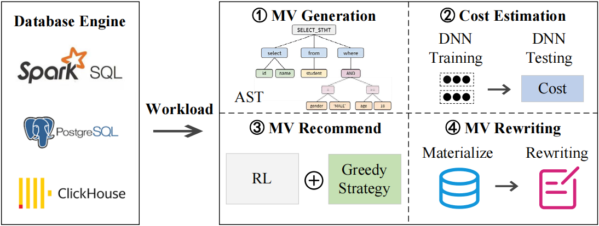

# UniView: A Unified Autonomous Materialized View Management System for Various Databases

Materialized views (MVs) are critical for the query performance of database systems, especially in online analytical processing (OLAP) databases. Existing approaches rely on DBAs to maintain MVs or focus on a specific database. However, DBAs cannot handle large scale databases like cloud databases, and typically a data warehouse for OLAP is hierarchical using different database engines at different stages. we develop UniView, a unified autonomous materialized view management system that supports various popular databases. We implement UniView and incorporate it into Spark SQL, PostgreSQL, and ClickHouse to evaluate its performance and make it practical.First, users configure data sets, database engines, training parameters and other parameters; Then UniView will automatically execute four modules according to the parameter configuration: (1) candidate view generation (2) cost evaluation (3) view recommendation (4) view rewriting; The user can actually view the training process, and at the end of the process, the UniView can provide temporary results and visual data from different aspects. Users can obtain the currently recommended view through the results and view the benefits brought by the recommended view.

